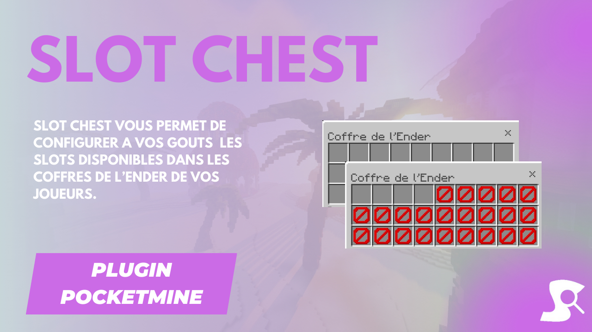

# EnderChest Plugin 📚

EnderChestSlots is a simple plugin that allows you to configure the number of slots in the enderchest.

## Features 🛠️

- **Configurable**: Various customization options.
- **Permissions**: Control slots access.
- **Messages**: Inform players of actions.

## Configuration 📝

```yaml
# EnderchestSlots config.

permission.slots:
  4: # Le nombre ici correspond au nombre de slot accordé au joueur
    permission: "slots.enderchest.4"
    default: user

enderchest.no.space: "§cVous n'avez plus de place dans votre enderchest."
```

## License 📜

Licensed under MIT. See [LICENSE](LICENSE) for details.

---

